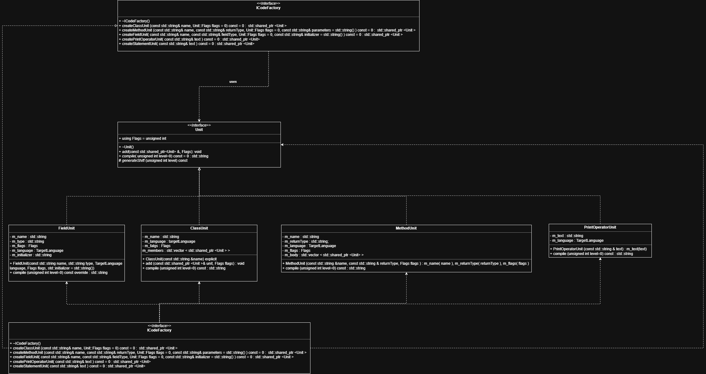

# Techn_Progr_Lab2

Генератор поддерживает C++, C# и Java. Для определения языка используется  
`TargetLanguage :: Cpp`  
`TargetLanguage :: CSharp`  
`TargetLanguage :: Java`

# UML

Для решения задачи используется паттерн «Абстрактная фабрика».

`ICodeFactory` - абстрактная фабрика, она создаёт конкретные фабрики  
- `CppCodeFactory` - конкретная фабрика для C++ кода  
- `CSharpCodeFactory` - конкретная фабрика для C# кода    
- `JavaCodeFactory` - - конкретная фабрика для Java кода  
 
`Unit` - общий интерфейс для всех сущностей (метод, класс, поле)
- `MethodUnit` - конкретная сущность - метод 
- `ClassUnit` - конкретная сущность - класс
- `FieldUnit` - конкретная сущность - поле  

 Для формирования кода в классе `Unit` есть метод `Unit::add()`, который принимает `std::shared_ptr<Unit>` умный указатель на объект `Unit`.  
 По умолчанию этот метод выбрасывает `std::runtime_error("Not supported")`, но переопределяется для `ClassUnit` и `MethodUnit`.

 В `main.cpp` представлен пример формирования кода - функция `buildProgram`, а в главной функции `main()` - использование непосредственно фабрики. 